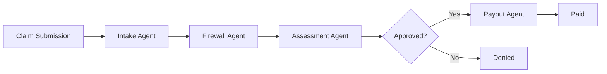

# Architecture

## Overview

Agent Mesh is a 4-agent insurance claims pipeline. Each agent is a discrete module that processes claims sequentially, logs decisions, and optionally publishes events via the Band SDK.

## Agent Flow

## Components

| Layer | Technology | Purpose |
|-------|-----------|---------|
| Frontend | Next.js 15, Tailwind | Dashboard + decision log visualization |
| API | FastAPI | REST endpoints for claims and audit log |
| Agents | Python modules | Intake, Firewall, Assessment, Payout |
| Band SDK | band-sdk | Inter-agent communication platform |
| Database | SQLite (dev) / Postgres (prod) | Claim persistence |
| Decision Log | JSON file | Real-time audit trail for dashboard |

## Decision Log

Every agent action is recorded in `backend/decision_log/audit_log.json`. The frontend polls `/api/decision-log` to render the pipeline timeline.

## Deployment

Docker Compose runs both services:

- Frontend: `:3000`
- Backend: `:8000`
